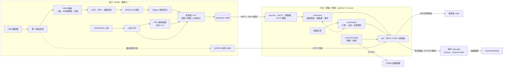
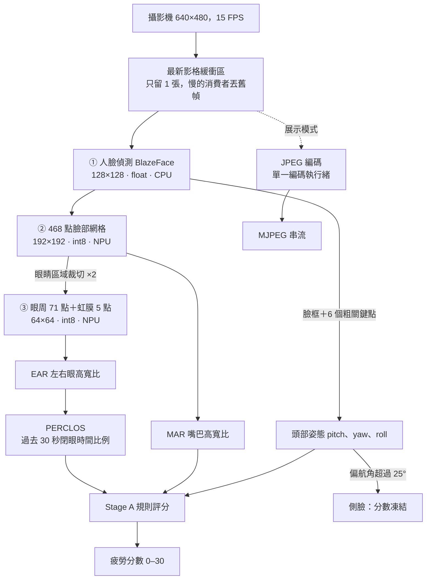
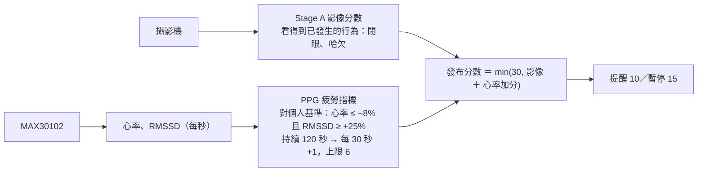
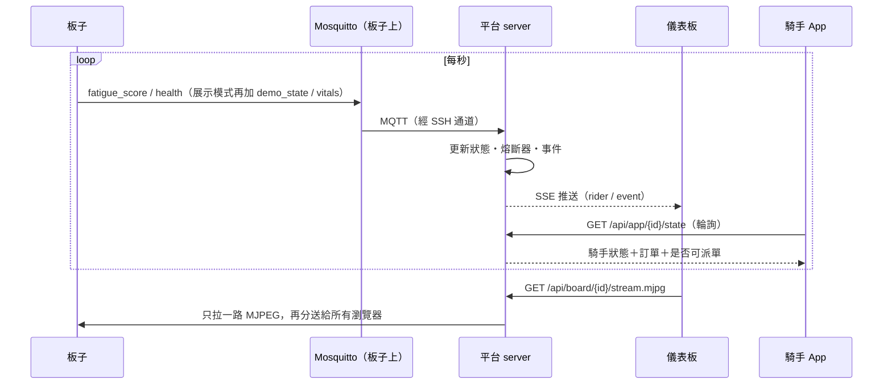
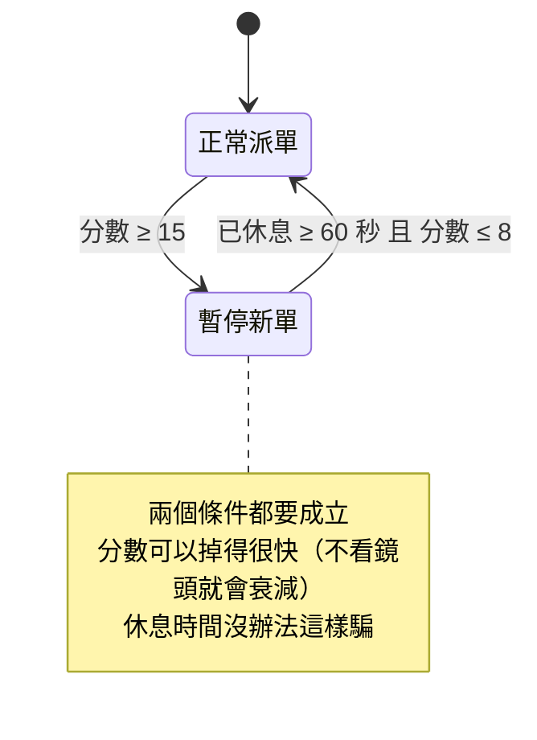
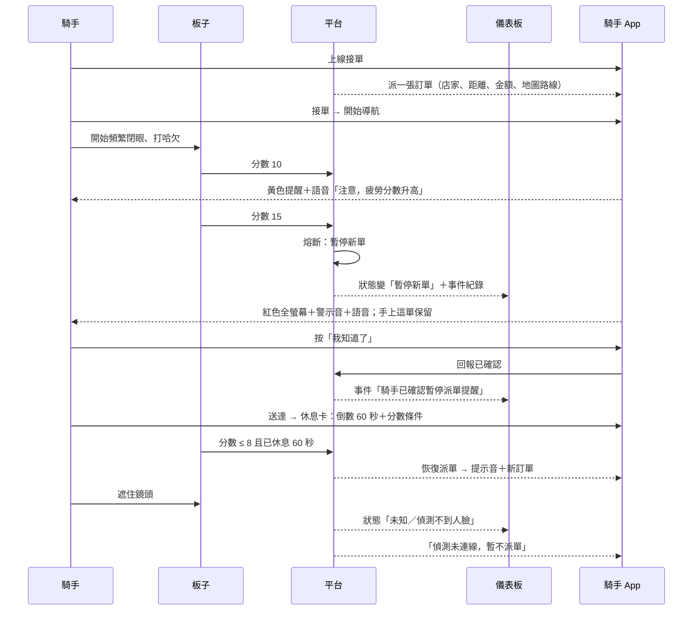

# 外送騎手疲勞風險偵測系統：系統總覽（簡報素材）

> 用途：給簡報製作用的單一來源文件。每個二級標題大致對應一張投影片的素材；圖用 Mermaid 寫，可直接重畫。
> 內容截至 2026-09-19，全部對照過 repo 內的程式與實機狀態。**「現況」欄位請照實呈現**：哪些已在實機跑、哪些只在本機、哪些還沒做，文末第 12 節有彙整。
> 更細的規格：`docs/API.md`（資料格式）、`docs/APP.md`（騎手 App）、`docs/nxp_dms_models.md`（模型）、`plan.md`（計畫與問題陳述）。

---

## 0. 一句話與三個重點

**一句話**：裝在機車上的邊緣裝置即時評估騎手的疲勞風險，平台依此**暫停派單**，騎手 App 同步用畫面、聲音、語音提醒——介入點是「不再派新單」，不是在車流中嚇人。

三個重點：

1. **影像不離開裝置**。板子在本地完成人臉推論，平時只送出「每秒一個分數」；影像只有在操作員明確開啟展示模式時才串流。
2. **訊號不可信就不亮綠燈**。偵測不到臉、攝影機故障、連線中斷，一律顯示「未知」，而且**不派新單**。
3. **一條規則串起三個畫面**。同一個熔斷器狀態同時決定：儀表板的狀態、App 收不收得到訂單、App 要不要提醒。

---

## 1. 系統全貌

四個部分：**板子**（感知與評分）、**平台**（狀態、熔斷、派單）、**儀表板**（派單員看）、**騎手 App**（騎手用）。



| 部分 | 位置 | 技術 | 角色 |
|---|---|---|---|
| 板子端 `rider/` | i.MX93 FRDM（Linux） | Python、OpenCV、TFLite、Ethos-U65 NPU | 感知、特徵、評分、發布、展示串流 |
| 平台 `server/` | 筆電（WSL），可上雲 | Python **純標準函式庫**（零套件） | 接收、狀態判定、熔斷、派單、API |
| 儀表板 `web/` | 瀏覽器 | 原生 ES modules（不用編譯） | 派單員：5 位騎手、分數曲線、事件、即時影像 |
| 騎手 App `app/` | 手機（PWA，可加到主畫面） | 原生 ES modules、Leaflet | 接單、地圖導航、疲勞提醒 |

---

## 2. 板子的硬體與輸入／輸出一覽

**硬體**：NXP i.MX93 FRDM（Cortex-A55 ×2，RAM 約 1.9 GB，儲存 8.2 GB）＋ Arm **Ethos-U65 NPU**。

### 輸入（感測器 → 板子）

| 訊號 | 硬體 | 介面 | 規格 | 現況 |
|---|---|---|---|---|
| 臉部影像 | Logitech C270 USB 攝影機 | USB／V4L2（`/dev/v4l/by-id/…`） | 640×480，實測擷取 15 FPS | ✅ 實機運作 |
| 心率（PPG） | MAX30102 | I²C `/dev/i2c-0`，位址 `0x57`；需 `vexp-3v3` 供電 | 100 sps、FIFO 平均 2 → **50 Hz**、18-bit | ✅ 已整合並**參與評分**（本機完成；目前實體線未接、尚未部署到板子） |
| 頭部傾角（IMU） | MPU6050 | I²C，位址 `0x68` | 只用加速度計 | ⏳ 模組寫好，**未接進線上評分** |
| 音訊 | 麥克風 | — | RMS＋主頻門檻 | ⏳ 模組寫好，未接進線上流程 |

### 輸出（板子 → 外部）

| 輸出 | 協定／埠 | 內容 | 頻率 | 何時送 |
|---|---|---|---|---|
| `riders/{id}/fatigue_score` | MQTT 1883，QoS 0 | `{timestamp, score}` | 1 Hz | **只有感知有效時**（抓得到正臉） |
| `riders/{id}/health` | MQTT | `{timestamp, perception}`，`ok`／`no_face`／`camera_error` | 1 Hz | **永遠送**，壞掉時更要送 |
| `riders/{id}/demo_state` | MQTT | EAR、MAR、PERCLOS、俯角、推論 FPS、加分原因 | 1 Hz | **只在展示模式** |
| `riders/{id}/vitals` | MQTT | 心率、RMSSD、訊號品質、6 秒脈搏波形（150 點） | 1 Hz | **只在展示模式** |
| MJPEG 影像 | HTTP `:8080/stream.mjpg` | 即時畫面＋DMS 疊圖（人臉框、468 點、狀態字） | 自適應 | **只在展示模式**，一般模式回 403 |
| 影像服務狀態 | HTTP `:8080/status`、`POST /mode` | 模式、觀看人數、畫質層級、攝影機健康 | 隨取 | 永遠 |
| （備援）同樣的 payload | HTTP POST 到平台 `/api/ingest/{id}/{kind}` | 與 MQTT 完全相同 | 1 Hz | 沒有 MQTT 時 |

**隱私設計**：一般模式下離開板子的只有「每秒一個數字＋健康狀態」。影像與生理訊號（心率）共用同一個「展示模式」開關，403 是在板子上強制的，不是只在網頁上藏起來。

---

## 3. 板子上的訊號鏈（感知 → 分數）



設計重點：

- **只有一個地方開攝影機**。推論、串流、校準錄影都讀同一個影格來源；緩衝區只留最新一張，推論慢就丟舊幀，不會累積延遲。
- **推論與發布是兩個時鐘**。推論跑多快算多快（約 15 FPS），發布固定 1 Hz；評分按「時間」累積，所以結果與幀率無關。
- **壞幀不會讓騎手離線**。單一幀分析失敗視為「這一幀沒有臉」，持續發生才會反映在健康狀態上。
- **心率在獨立行程讀取**。感測器 FIFO 只有 32 筆（0.64 秒）；放在主程式的執行緒裡會被推論與 JPEG 編碼拖到溢位（每 50 筆只收到 8 筆），改成子行程後準時輪詢。

---

## 4. 模型與 NPU 配置

三個模型都是 Google MediaPipe 的輕量臉部追蹤模型（NXP eIQ DMS 參考設計），**直接沿用，不自己訓練**。

| 模型 | 輸入 | 輸出 | 跑在哪 |
|---|---|---|---|
| face_detection_short_range（BlazeFace） | 128×128×3 | 896 個 anchor 的臉框＋6 關鍵點＋信心分數 | **CPU（float）** |
| face_landmark（FaceMesh） | 192×192×3（對齊裁切後的臉） | 468 點 ×(x,y,z) | **NPU（int8，Vela 編譯）** |
| iris_landmark | 64×64×3（單眼） | 眼周 71 點＋虹膜 5 點 | **NPU（int8，Vela 編譯）** |

**為什麼是 hybrid（偵測在 CPU、其餘在 NPU）**——實測（640×480，含前後處理，150 幀低角度影片）：

| 配置 | 每幀 | FPS | 偵測到臉 |
|---|---|---|---|
| 全 CPU（float，NXP 範例原本的做法） | 100 ms | 10 | 142/150 |
| 全 NPU（三個都量化） | 31.5 ms | 31.7 | **2/150** |
| **hybrid（現行預設）** | 47 ms | **21** | 142/150 |

全 NPU 最快但不能用：量化後的人臉偵測信心分數只剩約三個值（0.08／0.50／0.92），由下往上拍的臉落在 0.50，過不了 0.75 的門檻，而 0.50 與背景只差一個量化級距，降門檻也救不了。hybrid 保住偵測率，速度是全 CPU 的兩倍。hybrid 與全 CPU 的規則判斷一致率：閉眼 92–99%、哈欠 96.5–100%、低頭 100%。

> 實機上整條線受攝影機擷取速度限制，約 15 FPS。

---

## 5. Stage A 疲勞評分（規則式，沒有可學習權重）

一個「會漏的積分器」：有異常就加分，沒有就慢慢衰減。

| 規則 | 條件 | 加分 | 現況 |
|---|---|---|---|
| 閉眼比例（PERCLOS） | 過去 **30 秒**閉眼時間比例 > **10%**（閉眼＝NXP DMS 的定義：兩眼比例**都** < 0.2） | **+2／秒** | ✅ 計分 |
| 嘴巴張開（哈欠） | MAR 由下往上超過 **0.3**（預設採 NXP DMS 的判定線）；兩次事件至少隔 **1 秒**；持續張著只算一次 | **+3／次**（試過 NXP GoPoint 版的 +7 與 +5，都太重） | ✅ 計分 |
| 持續低頭 | 俯角 > 13° 持續 2 秒 | +5 | 👁 只顯示、**不計分**（鏡頭架低時俯角長期偏高，量到的是支架不是疲勞） |
| 衰減 | 沒有規則觸發時 | **−0.3／秒** | ✅ |
| 上限 | — | **30** | ✅ |

保護機制：

- **側臉（偏航角 > 25°）或抓不到臉：分數凍結**，不加也不減——看後照鏡不是閉眼，也不是休息。
- **資料中斷不算時間**：兩筆更新之間超過 1 秒的空檔，既不累積 PERCLOS 加分，也不衰減。
- **PERCLOS 暖機 5 秒**：剛啟動時一幀閉眼不會變成「100% 閉眼」。
- **與幀率無關**：持續訊號按秒累積、事件按次計分，同一段行為在 10 FPS 與 30 FPS 下得到相近的分數。
- 門檻都能在啟動時覆寫：`--mar-threshold`、`--perclos-threshold`、`--decay-per-sec`…

**與 NXP 內建判定的關係**（評審可能會問）：

| | NXP eIQ 範例（我們沿用的） | NXP GoPoint 展示版 | 我們的 Stage A |
|---|---|---|---|
| 輸出 | 逐幀標籤：Yawning／Eye Closed／Face 方向 | 0–100% 危險分數：<33 OK、33–66 **Warning**、≥66 **Danger** | 0–30 分，平台 15 暫停、8 恢復 |
| 時間概念 | 無（眨眼就標 Closed） | 逐**幀**加減（哈欠 +7、閉眼 +5、分心 +2、正常 −5） | 逐**秒**累積，PERCLOS 看 30 秒視窗 |
| 特性 | — | 與幀率相依；15 FPS 下閉眼不到 1 秒就 Danger、1.3 秒歸零——是「現在有沒有在看路」的即時警報 | 回答「過去一段時間累不累」，適合決定派單 |

逐幀判定線預設就是 NXP 的（`--criteria dms`：兩眼**都** < 0.2 才算閉眼、MAR > 0.3），已部署在板子上；`--criteria tuned` 可換回本專案調過的（兩眼平均 < 0.21、MAR > 0.4）。時間邏輯不變。

---

## 5b. 多模態：影像＋心率（PPG）



- **分工**：心率反映自律神經，文獻顯示它的變化**早於入睡**（Fujiwara 2019：13 次入睡前有 12 次先被偵測到）；影像看到的是已經閉上的眼睛。心率負責「提早把分數墊高」，影像負責「跨過門檻」。
- **為什麼心率加分上限只有 6（低於提醒線 10）**：真實道路上單靠 HRV 的三分類準確率只有 61%（Persson 2019，86 位駕駛）；系統性回顧的準確率從 44% 到 100% 都有（Lu 2022）。所以**單靠心率永遠不會提醒騎手或暫停派單**。
- **為什麼是「心率降＋RMSSD 升」**：76 位駕駛在真實高速公路上，越睏心率越低、副交感指標越高（Buendia 2019）。兩個都要成立，是因為只有心率下降就是等紅燈的樣子。
- **為什麼對個人基準比**：HRV 因人、年齡、情境而異，常模不能互相套用（Shaffer & Ginsberg 2017）；PPG 對短期變異的系統性高估（Schäfer & Vagedes 2013）在和自己比時會抵銷。
- **照實說**：方向與架構有文獻依據；8%／25%／120 秒這些數字是**待校準的工程起始值**，不是文獻給的。完整引用見 `docs/PPG_FATIGUE.md`。

---

## 6. 資料傳輸：協定、頻率、路徑



| 路段 | 協定 | 頻率 | 為什麼這樣選 |
|---|---|---|---|
| 板子 → 平台 | MQTT 3.1.1（QoS 0），主題 `riders/{id}/{kind}` | 1 Hz | 輕量；多塊板子用不同 id 發布就會自動出現在平台，**平台不用改設定** |
| 板子 ↔ 筆電的連線 | SSH 通道轉發 1883 | — | 板子的 Mosquitto 只聽 localhost，不改板子的系統設定；通道有監看、斷了自動重連 |
| 板子 → 平台（備援） | HTTP POST `/api/ingest/{id}/{kind}` | 1 Hz | 與 MQTT 走同一個 `ingest_message()`，格式與行為完全相同 |
| 平台 → 儀表板 | **SSE**（Server-Sent Events）＋ REST 快照 | 即時 | 單向推送、瀏覽器原生支援、斷線自動重連後補一次快照 |
| 平台 ↔ 騎手 App | **每秒輪詢** REST | 1 Hz | 行動網路與通道服務常緩衝 SSE；而且「多久沒回應」本身就是 App 需要的斷線判斷 |
| 板子影像 → 瀏覽器 | MJPEG，經平台**同源代理** | 自適應 | 不論幾個瀏覽器在看，平台只向板子拉一路；token 只存在後端 |
| 平台 → 路線服務 | HTTPS（OSRM） | 需要時 | 後端統一查詢＋快取；連不上退回直線估計 |
| 手機 → 平台（展示） | HTTPS（Cloudflare 臨時通道） | — | 通知、安裝、定位都要求 HTTPS；通道有監看，壞了自動換一條 |

**平台自己寫了一個純標準函式庫的 MQTT 3.1.1 客戶端**（`server/sources/mqtt_client.py`），所以整個後端不用安裝任何套件。

---

## 7. 展示影像串流設計

- **兩種模式**：一般（預設，影像端點回 403）／展示（操作員在儀表板按下才開啟；關閉時**正在播放的串流也會被切斷**）。
- **畫質跟著連線走**：觀看端收不到六成以上的畫面就降一級，連線穩定約 12 秒再升回去。

| 層級 | 寬度 | JPEG 品質 |
|---|---|---|
| 0 | 640 | 70 |
| 1 | 480 | 55 |
| 2 | 320 | 45 |
| 3 | 240 | 35 |

- **編碼只做一次**：單一編碼執行緒，不管幾個人看；沒有人看或不在展示模式時完全不編碼，不佔推論資源。
- **小的送出緩衝區**：舊影格不會排隊變成延遲。
- **疊圖**：人臉框、468 點網格、眼睛輪廓、Yawning／Eye／Face 狀態；沒抓到臉顯示紅色 NO FACE，現場調鏡頭角度用。
- **斷線續播**：板子程式重啟時，平台保持瀏覽器的連線 45 秒並自動接回，不會停在最後一格。

---

## 8. 平台的判斷邏輯

### 8.1 三層狀態（「舊的綠燈比沒有燈更糟」）

| 欄位 | 值 | 怎麼決定 |
|---|---|---|
| `link` 連線 | waiting → online → stale（>5 秒沒分數）→ offline（>15 秒） | 靠時鐘判斷：連線死掉時不會有訊息來通知 |
| `perception` 感知 | ok／no_face／camera_error／unknown | 板子的 health 訊息；超過 15 秒沒更新視為 unknown |
| `dispatch` 熔斷器 | normal／paused | 見 8.2；訊號中斷時凍結 |
| `status` 畫面顯示 | normal／paused／**unknown** | 連線不是 online、或感知回報故障 → unknown；否則跟著熔斷器 |

### 8.2 派單熔斷器



- **遲滯（15／8）**：分數在門檻附近晃動不會讓狀態反覆切換。
- **最短休息 60 秒**（`--min-rest`）：規則在熔斷器裡，所以儀表板與 App 看到同一個狀態。
- **躲鏡頭沒有用**：抓不到臉時板子不送分數，熔斷器停在「暫停」，要有即時的低分數才恢復。

### 8.3 派單規則（平台 → App）

| 情況 | 行為 |
|---|---|
| 熔斷器暫停（`dispatch_blocked: fatigue`） | 不派新單；**待回覆的訂單立刻撤回**；**已接的單保留**——送完再休息 |
| 沒有可信的偵測訊號（`no_signal`）：裝置未連線、訊號延遲／中斷、抓不到臉、攝影機故障 | **不派新單**（否則拔掉攝影機就成了繼續接單的方法）；已在畫面上待回覆的訂單保留 |
| App 超過 20 秒沒輪詢 | 視為 App 已關，不派單 |
| 待回覆訂單 30 秒沒回應 | 逾時 |

這些檢查放在 `OrderBook.offer()` 裡，任何訂單來源都繞不過去。

### 8.4 後端分層

```
server/
  core/      領域邏輯，不碰網路：models（驗證）、circuit_breaker、store（狀態與事件）、orders（訂單與派單規則）
  sources/   資料從哪來：mqtt_source、simulator（4 位模擬騎手）、order_simulator、routing
  api/       對外：REST＋SSE＋靜態檔＋板子影像代理
```

層與層只透過 `core/store` 溝通：要加新的資料來源只動 `sources/`，前端不用改。模擬騎手一律標示「模擬資料」，不會和真實裝置混在一起。

---

## 9. 騎手 App

**形式**：PWA——手機用瀏覽器開網址、「加入主畫面」就有圖示與全螢幕，iPhone 與 Android 同一份程式，不用上架、不用編譯；由同一個 Python 後端提供。

### 9.1 提醒分級

| 事件 | 條件 | 畫面 | 聲音／語音 | 震動 | 系統通知 |
|---|---|---|---|---|---|
| 注意疲勞 | 分數 ≥ 10（降到 8 以下才解除） | 黃色全螢幕，12 秒自動關閉 | 兩聲提示音＋一句語音 | 短 | 有 |
| 暫停派單 | 平台熔斷（≥ 15） | 紅色全螢幕，需按「我知道了」 | 警示音 12 秒內 3 次＋語音 2 次 | 長 | 有（常駐） |
| 恢復派單 | 休息滿 60 秒且分數 ≤ 8 | 自動關閉 | 上行提示音＋語音 | 短 | 有 |
| 偵測訊號中斷 | 上線中失去訊號 | 儀表變灰並說明原因 | 一聲＋語音 | 短 | — |
| 新訂單 | 平台派單 | 訂單卡＋倒數 | 提示音＋唸出店名、距離、金額 | 短 | App 在背景時 |

- 只在**狀態改變**時提醒，不會每秒一直響；聲音刻意短、會自己停——在車流中嚇到人本身就是風險。
- 騎手按「我知道了」會回報平台，儀表板事件紀錄出現「騎手已確認…」：**平台看得到提醒真的送到人了**。
- 休息卡列出兩個恢復條件各自的進度（倒數、目前分數）。
- 提示音用 Web Audio 合成（不帶音檔），語音用手機內建中文語音；每個管道可單獨關閉與試聽。

### 9.2 地圖與 App 內導航

- 地圖：Leaflet＋OpenStreetMap 圖磚（免金鑰）；路線：後端向 OSRM 查詢並快取。
- **逐向導航**：上方是下一個轉彎（箭頭＋距離＋路名），地圖跟著騎手走；中文語音約在 300／120／30 公尺各唸一次；偏離路線 60 公尺自動重新規劃。
- **為什麼自己做導航**：跳到 Apple／Google 地圖時 App 被放到背景，疲勞提醒送不到。App 內導航時，提醒的全螢幕畫面直接蓋在導航上；**疲勞提醒的語音優先於導航語音**。
- 騎手在路線上的進度由手機自己算（純幾何），不需要每次移動都問後端。
- **模擬騎乘**：會場裡沒辦法真的騎，開啟後位置沿路線自動前進；只要是模擬的，畫面一直標示「模擬定位」。

### 9.3 App 分層

```
app/js/
  api/        唯一知道後端網址的地方
  state/      狀態、疲勞等級判定、何時重抓路線
  alerts/     提醒引擎（唯一決策點）＋聲音／語音／震動／通知／螢幕常亮
  nav/        路線進度計算、轉彎語音時機
  geo/        手機 GPS、模擬騎乘
  screens/    登入、主畫面、提醒、設定、地圖、導航
```

---

## 10. 端到端情境（展示腳本）



---

## 11. 數字速查

| 項目 | 數值 |
|---|---|
| 攝影機 | 640×480，實測擷取 15 FPS |
| 推論（hybrid） | 基準測試 21 FPS（47 ms／幀）；實機約 15 FPS（受攝影機限制） |
| 全 CPU／全 NPU 對照 | 10 FPS／31.7 FPS（全 NPU 低角度只抓到 2/150 張臉） |
| 發布頻率 | 1 Hz（分數、健康；展示模式加細節與心率） |
| 分數範圍／上限 | 0–30 |
| App 提醒線／暫停線／恢復線 | 10／15／8 |
| 最短休息 | 60 秒（與分數條件同時成立才恢復） |
| PERCLOS | 視窗 30 秒（展示設定；實際使用 60 秒）、門檻 10%、暖機 5 秒 |
| 哈欠 | MAR > 0.3（DMS 判定線），冷卻 1 秒，**+3／次** |
| 衰減 | −0.3／秒（暫停線 15 → 恢復線 8 約 23 秒；上限 30 → 8 約 73 秒） |
| 側臉凍結 | 偏航角 > 25° |
| 連線判定 | > 5 秒未更新 = 延遲（顯示未知）；> 15 秒 = 離線 |
| 心率感測 | 50 Hz 取樣，12 秒視窗；連續 5 個候選值落在 5 bpm 內才鎖定 |
| RMSSD（可中斷） | 合併最近 60 秒內「相鄰心跳間隔的差」，滿 30 組出值；不跨中斷、排除晃動前後 2.5 秒。實機舊作法只有約 5% 的有效秒數有值 |
| 心率疲勞指標（多模態） | 個人基準 300 秒；近 120 秒心率 ≤ −8% **且** RMSSD ≥ +25%，持續 120 秒後每 30 秒 +1，**上限 6**（低於提醒線 10） |
| 影像畫質層級 | 640/70 → 480/55 → 320/45 → 240/35 |
| 訂單 | 待回覆 30 秒逾時；App 20 秒沒輪詢不派單 |
| App 輪詢 | 1 Hz；6 秒沒回應顯示「與平台連線中斷」 |
| 導航語音 | 約 300／120／30 公尺；偏離 60 公尺重新規劃 |
| 後端相依套件 | **0**（純 Python 標準函式庫） |
| 自動化測試 | 83 個（熔斷器、狀態規則、MQTT 假 broker、HTTP 端到端、訂單與派單規則、路線、Stage A 時間尺度、心率 DSP、PPG 疲勞指標） |

---

## 12. 現況與限制（請照實呈現）

### 已在實機驗證

- 真實攝影機 → DMS 推論（hybrid，NPU）→ Stage A → MQTT → 平台 → 儀表板，含暫停／恢復派單與展示影像。
- 多塊板子自動註冊；訊號中斷／抓不到臉／攝影機故障的「未知」狀態。
- 騎手 App 後端規則（全系統共 83 個自動化測試）、App 畫面（桌面瀏覽器以手機尺寸截圖驗證）、手機經 HTTPS 通道連線。

### 已實作、尚未完成驗證或部署

- App 的聲音／語音／通知／GPS／導航語音：**尚未在真實手機上完整驗證**。
- 心率疲勞指標（多模態）：本機完成並有 9 個測試，**尚未部署到板子、感測器實體未接、從未用真人資料驗證**；門檻是待校準的工程起始值（`docs/PPG_FATIGUE.md`）。
- IMU、音訊模組：已寫好，**未接進線上評分**。

### 設計上的限制

- **分數是原型風險指標**：門檻需要校準；閉眼、哈欠的動作演示不等於已證明能辨識真實疲勞或預防事故。
- **App 被關掉或手機鎖屏後收不到提醒**：目前是「頁面還活著時發的本機通知」；要叫醒手機需要 Web Push 或原生推播。
- **沒有登入機制**（儀表板的模式切換、騎手 App 都是）：只適合展示用的區網／通道。
- 平台狀態在記憶體裡，重啟即清空；訂單是模擬的，未串接真實外送平台。
- 路線與圖磚用的是免費公開服務（OSRM 示範伺服器、OpenStreetMap）：汽車路網、無保證、有流量限制；導航沒有車道指引與即時路況。
- 展示用的 Cloudflare 臨時通道：連線中斷數分鐘後網址會變，手機要重新加入主畫面。
- 板子與筆電目前仰賴手機熱點，熱點休眠時會同時掉線。
- `plan.md` 問題陳述裡的統計數字、法規日期與引述**尚未逐一查證來源**，放進簡報前要核對。

### 未來方向

Stage B（MLP）離線比較與 NPU 部署、「即時閉眼警示」層（閉眼超過約 1 秒立即提醒，獨立於派單分數）、IMU 交叉驗證低頭、用真實騎手資料校準心率指標的門檻、Web Push／原生 App、登入與資料庫、自架 OSRM（機車設定檔）。

---

## 13. 建議的投影片順序

1. 問題：疲勞駕駛沒有「酒測器」，外送員是最集中的族群（數字引用前先核對）
2. 解法一句話＋三個重點（第 0 節）
3. 系統全貌圖（第 1 節）
4. 板子的輸入／輸出（第 2 節）——強調「平時只送一個數字」
5. 訊號鏈：影像 → 三個模型 → 特徵 → 分數（第 3 節）
6. NPU 的取捨：為什麼是 hybrid（第 4 節的對照表）
7. Stage A 評分規則與保護機制（第 5 節）；多模態：影像＋心率，含文獻依據（第 5b 節）
8. 資料怎麼流：MQTT／SSE／輪詢，各自的理由（第 6 節）
9. 平台判斷：未知狀態、熔斷器狀態圖、派單規則（第 8 節）
10. 騎手 App：提醒分級＋App 內導航（第 9 節）
11. 端到端情境（第 10 節）＝現場展示腳本
12. 現況、限制與未來方向（第 12 節）
